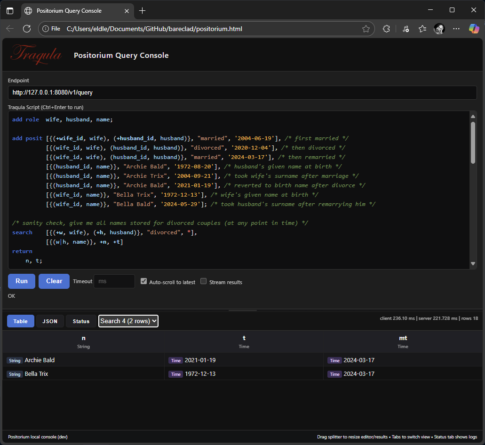

<p/>

Positorium is an experimental database engine based on Transitional Modeling, designed to capture conflicting, unreliable, and varying information over time. It blends ideas from relational, graph, columnar, and key–value stores.

- [The Philosophical Foundations of Positorium](THEORY.md)
- [Paper: Modeling Conflicting, Unreliable, and Varying Information](https://www.researchgate.net/publication/329352497_Modeling_Conflicting_Unreliable_and_Varying_Information)

## Why Positorium?

Most databases assume a single, consistent truth. In reality, facts are messy: they conflict across sources, change over time, and sometimes carry uncertainty. Positorium treats this as a first‑class concern:

- Contradictions are preserved, not overwritten (assertions can be affirmed or negated with certainty).
- Time is built into every posit, so “what was true when” is natural to ask.
- Set‑based evaluation with roaring bitmaps keeps pattern matching fast without exploding joins.

This makes Positorium well‑suited for master data management, regulated domains, investigations/intel, and any workflow where evidence accumulates and is revised.

<br/>

## Traqula DSL

Traqula is Positorium's domain-specific language for defining roles, positing facts with time, and querying data through pattern matching. It supports variables that persist across commands, allowing complex multi-step operations.

For the complete language reference, examples, and details on posits, variables, and search patterns, see [TRAQULA.md](TRAQULA.md).

## Build and run

Prereqs: Rust toolchain and a C toolchain for rusqlite (bundled is enabled).

Build:

```sh
cargo build
```

Run the binary; it will read configuration from positorium.json and execute the Traqula script at traqula/example.traqula:

```sh
target/debug/positorium
```

Config (positorium.json):

```json
{
	"database_file_and_path": "positorium.db",
	"recreate_database_on_startup": true,
	"traqula_file_to_run_on_startup": "traqula/adds.traqula"
}
```

## Initialization Modes

The engine now uses an explicit persistence mode enum:

```rust
use positorium::construct::{Database, PersistenceMode};

// Ephemeral: nothing is written, all data lost when process exits
let db = Database::new(PersistenceMode::InMemory);

// File-backed persistence (creates or reuses SQLite file)
let db = Database::new(PersistenceMode::File("positorium.db".to_string()));

// Derive from config style flags
let enable = true; // imagine read from config
let mode = PersistenceMode::from_config(enable, "positorium.db");
let db2 = Database::new(mode);
```

When running the provided binary, the `enable_persistence` flag in `positorium.json` selects between these modes internally.

## Integrity Ledger

When running in file‑backed persistence mode, Positorium records a compact integrity signal alongside persisted posits: a rolling hash over each persisted row. This ledger is always maintained for file‑backed databases and is intended as a lightweight way to spot accidental edits or simple corruption during local inspection.

Note: this is not a full audit or tamper‑proof trail. It provides a quick, low‑overhead check but does not protect against an attacker with write access who can recompute the chain or against external threats without anchoring. See the `persist` module for implementation details if you need stronger guarantees.

## Client / Server Architecture

Positorium can run as a library or an HTTP server. The server layer (Axum + Tokio) exposes a JSON endpoint:

`POST /v1/query`

Request body:
```jsonc
{ "script": "search [{(*, name)}, +n, *] return n;", "stream": false, "timeout_ms": 5000 }
```

Response (single result set):
```jsonc
{
	"id": 0,
	"status": "ok",
	"elapsed_ms": 1.23,
	"columns": ["n"],
	"row_types": [["String"]],
	"row_count": 2,
	"limited": false,
	"rows": [["Alice"],["Bob"]]
}
```

If the script contains multiple `search` commands, the response omits top-level `columns/rows` and instead returns `result_sets` (array of result set objects) with cumulative `row_count`.

### Starting the server

You can run the server directly with the binary or use the convenience scripts provided for different platforms.

Windows (PowerShell):
```powershell
. .\scripts\positorium.ps1                  # dot-source to load functions
Start-Positorium -LogProfile normal -Tail   # run and stream logs live
Stop-Positorium                             # stop
Restart-Positorium -LogProfile verbose      # restart with different profile
```

macOS / Linux (bash):
```bash
chmod +x scripts/positorium.sh            # first time
./scripts/positorium.sh start --profile normal --tail   # foreground (logs to console)
./scripts/positorium.sh stop
./scripts/positorium.sh restart --profile verbose --force-rebuild
./scripts/positorium.sh start --log 'warn,positorium=info'  # custom RUST_LOG filter
./scripts/positorium.sh tail               # follow log file if started in background
```

Both scripts support a common set of logging profiles mapped to `RUST_LOG`:

LogProfile | RUST_LOG
:--|:--
quiet | `error`
normal | `info`
verbose | `debug,positorium=info`
trace | `trace`

You can override the profile with an explicit `--log` / `-Log` argument (EnvFilter syntax) such as `warn,axum=info,positorium=debug`.

The bash script maintains a PID file at `.positorium.pid` and writes background logs to `positorium.out`; use `--tail` (bash) or `-Tail` (PowerShell) to stream logs directly instead.

Logging uses `tracing` with `RUST_LOG` filtering.

### Web UI (positorium.html)

A minimal static HTML client (`positorium.html`) demonstrates submitting scripts to the server endpoint and rendering results. Open it in a browser (or host it) and point the form to your server's `/v1/query` URL.



## Updated Status and Roadmap

Implemented:
* Roles, appearances, appearance sets, heterogeneous posits with times
* Persistence via SQLite + tamper-evident ledger (file mode)
* Traqula parsing (Pest) for add/search/where/return, unions, multi-result scripts
* Bitmap-backed indexes for fast intersections
* Time filtering (variable vs literal and variable vs variable)
* Value predicate filtering (variable vs literal & variable vs variable) with type-aware ordering checks
* Certainty percent-only literals and strict ordering rules
* HTTP server (Axum), JSON query endpoint, multi-result response encoding
* PowerShell helper script for lifecycle (start/stop/restart) with logging presets
* Minimal HTML client page
* Execution error surfacing (unknown variable, type mismatch, ordering misuse)
* Streaming row delivery over HTTP (chunked / SSE)

Planned/next:
* WHERE enhancements: OR, grouping, BETWEEN, IN
* Aggregations and tuple-shaped / structured returns
* Projection type annotations stabilization (avoid dynamic probing)
* Authentication / access control for the server
* Optimization: caching value extraction during predicate evaluation
* Optional JSON/CSV export helpers

## Long-term Goals

These are aspirational features that align with the full vision of Transitional Modeling, extending Positorium beyond its current experimental state:

* **Advanced Query Capabilities**: Implement all theoretical query types from Transitional Modeling, including probabilistic searches (e.g., "find facts with at least 75% certainty"), audit trails (e.g., "show all corrections between dates"), and log-like queries (e.g., "all model changes by a specific identity").
* **Constraint and Schema Management**: Add support for subjective, evolving constraints and classifications that can be applied late, enabling "eventual conformance" for data integrity without rigid upfront schemas.
* **Multi-tenant and Collaborative Features**: Enhance multi-tenant support for disagreements and consensus tracking, allowing collaborative modeling where different observers can maintain concurrent, conflicting models.
* **Uncertainty Theory Integration**: Extend certainty handling to full uncertainty theory, supporting complex logical consistency checks across collections of opinions.
* **Performance and Scalability**: Optimize for large-scale deployments with distributed persistence, advanced indexing, and parallel query execution.
* **Ecosystem Expansion**: Develop integrations with other databases, visualization tools, and APIs; add more data types (e.g., geospatial, multimedia); and build a plugin system for custom extensions.
* **Production Readiness**: Implement enterprise features like backup/restore, replication, monitoring, and compliance tooling to transition from experimental to production-grade.

## License

This work is dual-licensed under Apache 2.0 and MIT. You can choose between one of them if you use this work.

SPDX-License-Identifier: Apache-2.0 OR MIT
